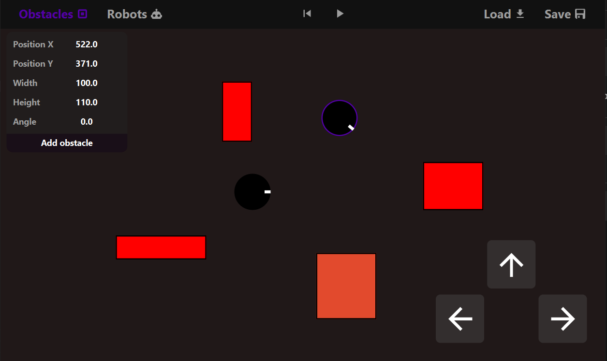

# IJA project



## Run

```bash
mvn javafx:run
```

## Compilation, Documentation, Downloading dependencies, Executable
```bash
  mvn 
```

## Run executable:
```bash
  java -jar project-1.0.0.jar
```
